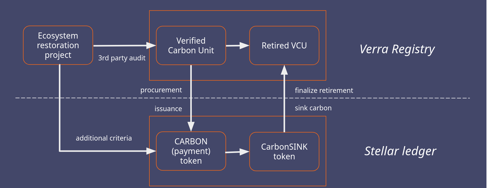
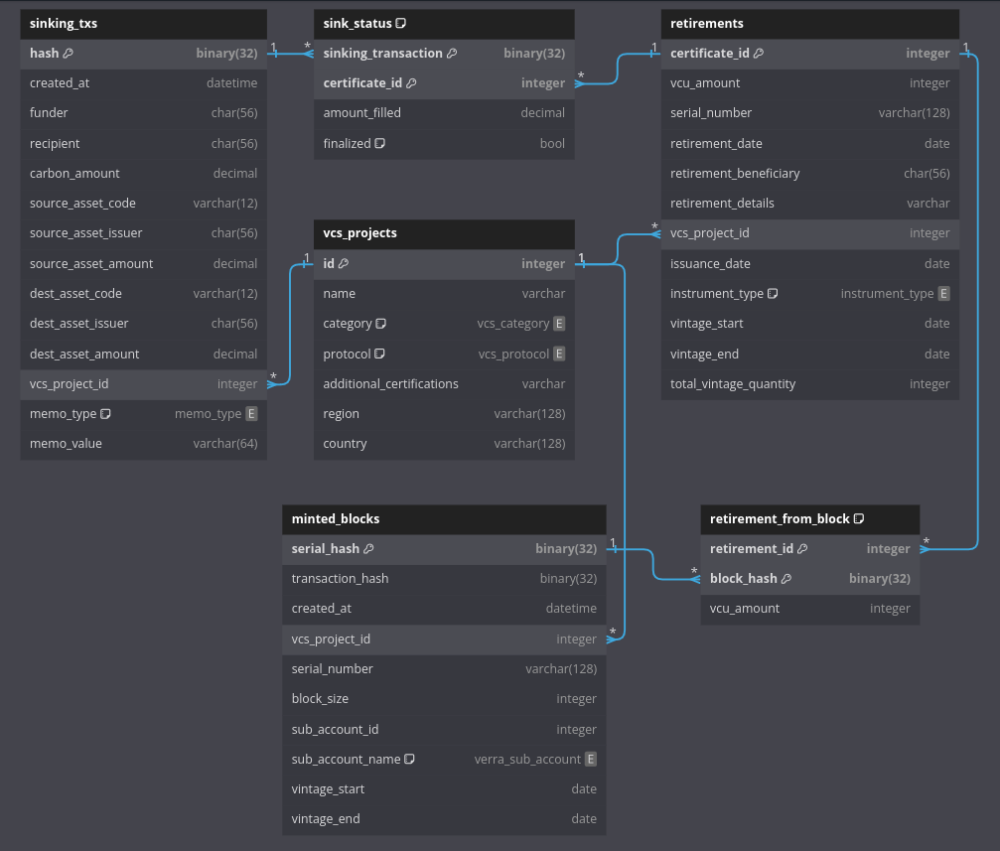

# Stellarcarbon Technical Architecture

We have been building the infrastructure needed to connect legacy carbon markets with the new digital economy taking place on public ledgers. Other companies building on Stellar are able to integrate our backend service into their products and services, to give users easy access to eco-credit retirements. On top of this infrastructure, Stellarcarbon itself wants to develop and launch a retail shop aimed at individuals and businesses.

This document first briefly gives an overview of our current service, before going into detail on what we want to add in our SCF #25 submission.

<!-- TOC start (generated with https://github.com/derlin/bitdowntoc) -->

- [Current Version](#current-version)
- [SCF#25: Fractional Retirements](#scf25-fractional-retirements)
   * [Database](#database)
   * [Stellarcarbon API](#stellarcarbon-api)
   * [User Interface](#user-interface)
   * [Soroban](#soroban)
   * [Legal](#legal)

<!-- TOC end -->

## Current Version

The current Stellarcarbon service has been functional for integration partners, but does not yet offer a usable retail interface. We have a [website](https://www.stellarcarbon.io/) running on a Wordpress platform, and we've run into its limitations regarding further Stellar integration. Separately, our partners have been integrating [our API](https://api-beta.stellarcarbon.io/docs) into their frontends. We've started building a [new website](https://sc-website-eosin.vercel.app) based on the NextJS framework that exposes the kind of interactivity that we want to offer to our users.

Our infrastructure enables the integration between the Stellar network and traditional carbon credit registries. For our pilot project we've built a connection with the Verra Registry, where we hold an inventory of credits (with additional community and biodiversity benefits) that can be retired on behalf of our users.

At a high level of abstraction, the integration between Stellar and the Verra Registry looks like this:

We've developed a prototype retail-oriented checkout UI that was intended to be deeplinked from our current website. It was realistic enough that it enabled us to do usability testing with several participants. It has been used in production to do actual credit retirements (even with a hardware wallet), but only by team members and a couple of testers. In late 2023 we decided to not move forward with this checkout UI as a production system, because we can offer a better user experience by redesigning our website as a web app that includes the checkout functionality as well as user account management.

The interaction flow between the user, frontends, and backend systems does provide important context for our current proposal. This interaction mostly remains structured the same, however, with our website redesign the "Website" and "Offsetting App" have become collapsed into a single system.

## SCF#25: Fractional Retirements

The work on fractional retirements can be separated into five distinct layers: database, API, user interface, Soroban interface, and legal.

### Database

Stellarcarbon prefers to minimize its energy usage. So far, we haven't had to operate our own database. We've gotten by using only the Stellar ledger and the Verra Registry as persistent storage. Implementing fractional retirements changes this. Providing a good user experience is no longer feasible when data from Horizon and the Verra Registry need to be queried and joined each time a user wants to view or change the state of their account. We need to store data on the Stellar transactions that users do through Stellarcarbon, the retirements that we finalize in the Verra Registry, and particularly on the relations between them.

We want interested third parties to have access to the same data that we do, in order to independently verify that Stellarcarbon is operating with integrity. The majority of our database tables contain public information. We will implement the core of our database logic in an open-source repository, and will provide simple instructions on how to fill the database from the original data sources, as well as check the state of our issuance and retirement process.

As you can see in the above database schema, the data that we need to store is well suited for storage in a relational DB. The `sinking_txs` table can be entirely filled with data that is obtained from Horizon, giving a historical view on transactions that have already been included in the Stellar ledger. Similarly, the `retirements` table can be filled by querying the Verra Registry, without needing any additional data sources. The `minted_blocks` are partly populated by transactions done by the CARBON issuer account, but since these transactions only include hashes of the original block serial numbers (as hash memos), there is some information missing from the public record and historical blocks cannot be easily reconstructed. Historical blocks can, however, be reconstructed by adding some internal Stellarcarbon data, which we'll publish in the open-source repository with our database logic. Newly minted blocks can be independently loaded as long as none of their credits have been consumed yet.

The aforementioned tables are all filled with immutable records. During the design of this database schema, it occurred to us that we can implement the m2m relations between these tables as immutable objects as well. Some parsing is required to construct the `sink_status` and `retirement_from_block` objects, but once they have been inserted into the DB, they won't need to be updated. The views on pending retirements and Stellarcarbon's current inventory can be computed by joining these tables. This design makes it easy to dump tables as a collection of insert statements, allowing database operators to restore or catch up from a dump without having to deal with complicated synchronization logic.

### Stellarcarbon API

The account management functionality needs to be exposed by our API. It will be extended with endpoints that list an account's transactions and their status, and view all retirements associated with an account. The existing registry endpoints will be deprecated and replaced with views on Stellarcarbon's inventory and retirements that are populated by the database. A retirement detail view will also incorporate the relation with transactions, and shows a breakdown of the amount of credits retired. Lastly, an endpoint needs to be added which allows a user to ask that Stellarcarbon immediately retires the credits that correspond to their pending balance.

Several improvements are needed to ensure that fractional retirements can be processed smoothly. A background job needs to be added to the backend to ensure that users won't need to take any action for their pending retirements to be finalized when they add up to a round number. Another job will query the database for pending balances older than e.g. 90 days, and bundle them into a collective retirement. We also need a new staging deployment to facilitate integration testing. Our current version is not consistently available on testnet because Verra lacks a testing/staging environment. After we have implemented our database, we can sufficiently mock Verra data to make a staging environment that writes to testnet available at all times.

### User Interface

The fractional retirement functionality will be located in the account management interface that we've already started to build. We want to present fractional retirements to users as an integral part of Stellarcarbon, rather than as a separate feature. Our integration partners have implemented their own frontends for end-users to sink carbon, but we expect our website to be the main hub for account management for their users as well as our own retail audience.

We've designed our user dashboard to have its functionality split into three tabs, to: sink carbon, proceed with pending retirements, and view past transactions. On the pending retirements tab, users will be able to see how much additional carbon they'd have to sink to obtain their next individual retirement certificate from Verra. Alternatively, users with a pending balance of at least 1 tonne may choose to immediately request a certificate for their whole tonnes. The tab will also show for each transaction when their right to an individual retirement certificate will expire, after which the transactions can be bundled with those of other users, leading to a collective retirement certificate.

### Soroban

Stellarcarbon needs to expose at least some functionality through Soroban. Our integration partner CFCE has been writing smart contracts to automatically split donation payments, and to emit a contract event whenever the funds that are accumulated to be used for credit retirement exceed the price of 1 tonne. Without the ability to actually sink carbon from within a Soroban contract, we're left with an annoying manual step in this integration. We want to develop a simple smart contract that allows the atomic swap of our payment token (CARBON) for our locked retirement token (CarbonSINK) to be done with Soroban. The Stellar Asset Contract will be used to interact with the existing tokens.

It is paramount to maintain our operational security, and we expect some challenges relating to the use of the CarbonSINK issuer keypair in authorizing transactions to occur on Soroban. We want to initially only publish this smart contract on testnet to allow for sufficient time to test the integration together with our partner, and to have as much time as we need to consider the security implications of launching the contract on the public network.

### Legal

By deviating from our current "sink one tonne on Stellar, receive a certificate for one tonne from Verra" model, we're increasing the need to clearly explain the terms that govern the use of Stellarcarbon's service. It doesn't change the fundamental principle that Stellarcarbon retires eco-credits on behalf of its users. The conditions under which users can obtain an individual retirement certificate from Verra, however, become more complicated. Some kind of expiration on pending retirements is necessary because they require Stellarcarbon to hold a credit in its inventory that has already been reserved by a user. The liability corresponding to the total pending balance needs to be bounded, because letting it grow forever would pose risks to both Stellarcarbon and its users.

We'll draft the terms of use ourselves, after which we can get a legal consultation. Once the terms have been published on our website and are linked to from our API, we'll be able to launch our retail-oriented service. Making standard terms available will also facilitate the integration of our API into other products and services, reducing the need for separate partnership agreements.
