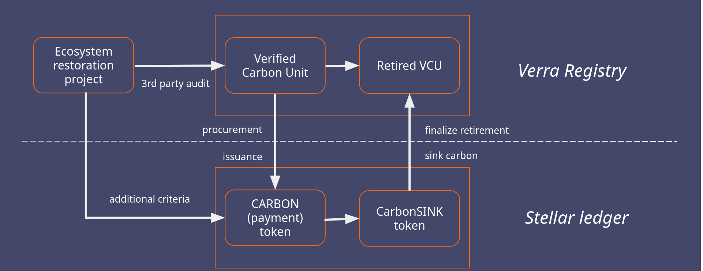
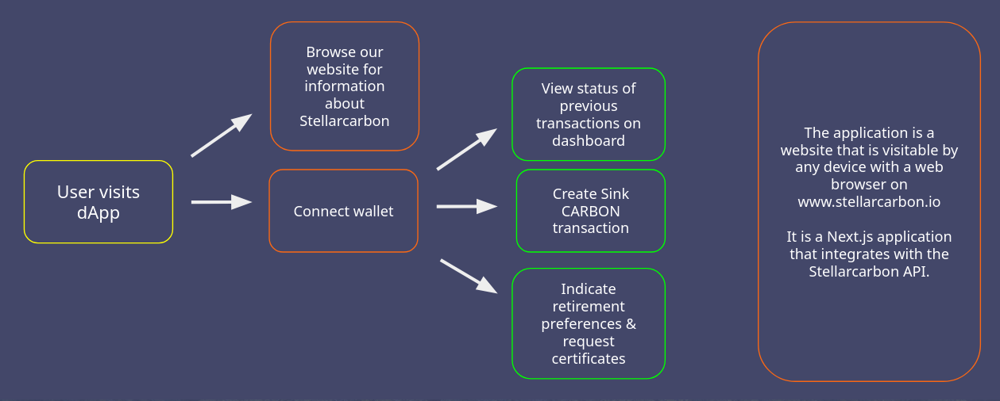
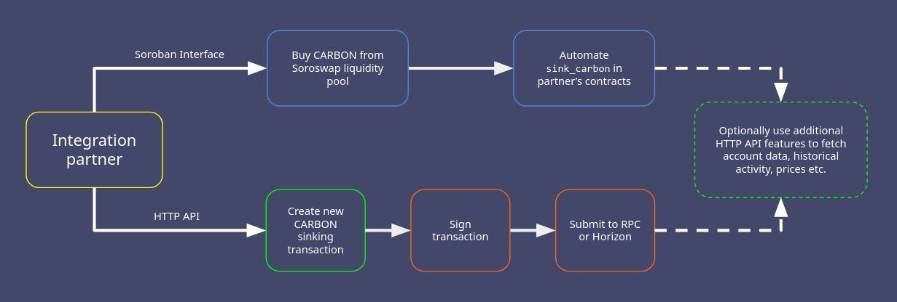

# Stellarcarbon Technical Architecture

We have been building the infrastructure needed to connect legacy carbon markets with the new digital economy taking place on public ledgers. Other companies building on Stellar are able to integrate our backend service into their products and services, to give users easy access to eco-credit retirements. On top of this infrastructure, Stellarcarbon itself wants to develop and launch a retail shop aimed at individuals and businesses.

This document first briefly gives an overview of our latest progress, before going into detail on what we want to add in our SCF #33 submission.

<!-- TOC start (generated with https://github.com/derlin/bitdowntoc) -->

- [Progress](#progress)
- [Interaction Overview](#interaction-overview)
  - [Retail user flow](#retail-user-flow)
  - [Integration partner flow](#integration-partner-flow)
- [Soroban Interface](#soroban-interface)
  - [SAC for CARBON](#sac-for-carbon)
  - [SAC for CarbonSINK](#sac-for-carbonsink)
  - [Sink Carbon Contract](#sink-carbon-contract)

<!-- TOC end -->

## Progress

Our infrastructure enables the integration between the Stellar network and traditional carbon credit registries. For our pilot project we've built a connection with the Verra Registry, where we hold an inventory of credits (with additional community and biodiversity benefits) that can be retired on behalf of our users.

At a high level of abstraction, the integration between Stellar and the Verra Registry looks like this:

In 2024, we've hit several major development milestones. We've delivered the full fractional retirements functionality we set out to build at the beginning of the year:

- Open-source data structures, monitoring and auditing [tool](https://github.com/stellarcarbon/sc-audit)
- Public mainnet [data dumps](https://github.com/stellarcarbon/sc-data/tree/main/sc-audit) for those without access to full-history Horizon
- 8 new [API](https://api.stellarcarbon.io/docs) releases, providing account management and a testnet environment
- A new [dApp frontend](https://github.com/stellarcarbon/sc-website/tree/develop) with built in shop and fractional retirements support, to replace our old website

For an extensive description of these milestones, see our [previous architecture doc](/docs/architecture-fractional.md).

As a bonus achievement, we've launched a working (mainnet) [demo dApp](https://new.stellarcarbon.io/) featuring a flight emissions calculator in time for Meridian 2024. Give it a spin!

## Interaction Overview

In this section we provide an overview of the interactions and interfaces in our product. Our two target audiences "retail users" and "integration partners" use our system in these ways.

The blocks are color coded per service. Red is a dApp frontend (ours or a partner's), green is our HTTP API and blue is Soroban.

### Retail user flow

These users visit our website individually looking to compensate CO₂ emissions or contribute to biodiversity. They can browse information about Stellarcarbon and easily engage with Stellarcarbon functionality after connecting their wallet.

### Integration partner flow

We provide two options for integration partners that want to provide CO₂ compensation methods in their own offerings. Either through a Soroban integration or by using our HTTP API. Optionally, they may also use the HTTP API to fetch dynamic information about Stellarcarbon, including the activity of their own users.

## Soroban Interface

We want to develop a simple smart contract that allows the atomic swap of our payment token (CARBON) for our locked retirement token (CarbonSINK) to be done with Soroban. The [Stellar Asset Contract](https://developers.stellar.org/docs/tokens/stellar-asset-contract) (SAC) will be used to interact with the existing tokens. This will allow further automation through smart contracts, and let integration partners choose between Soroban and a classic Stellar + HTTP API approach, with equivalent functionality.

To enable payments through Soroban, we aim to use a Soroswap liquidity pool for CARBON/USDC as an alternative for the built in payment functionality of our API. It will be of limited size (since all our CARBON is fully backed), and the Stellarcarbon backend will automatically replenish the pool to keep its price in line with our primary sales. We'll start with a constant product pool on testnet but we plan to migrate to a concentrated liquidity pool as soon as Soroswap launches it.

### SAC for CARBON

This contract is used to interact with the CARBON asset on behalf of the transaction invoker.

**Admin:** CARBON issuer

### SAC for CarbonSINK

This contract is used to interact with the CarbonSINK asset within the sink carbon contract. It needs to be able to execute the authorization sandwich without needing additional signatures.

**Admin:** sink carbon contract

### Sink Carbon Contract

Our sink carbon contract implements one user-facing function `sink_carbon`. With admin privileges, it also needs to enable resetting the CarbonSINK SAC admin and toggling a circuit breaker.

**Admin:** CarbonSINK issuer

**Instance TTL:** threshold 29 days, extend amount 30 days

**Instance storage:**

- Admin: Account
- CarbonSinkID: Address
- IsActive: bool

#### fn \_\_constructor

Arguments:

- admin: will be set to the CarbonSINK issuer
- carbonsink_id: CarbonSINK SAC address

Additionally puts IsActive: true in instance storage.

#### fn sink_carbon

Arguments:

- funder: Address
- recipient: Address
- amount: i64
- project_id: i32
- memo_text: Bytes
- email: Bytes

Auth required: funder

Atomically swap an amount of CARBON held by the funder to CarbonSINK in the recipient account. In common usage the funder and recipient addresses are equal. The CARBON is burned by the funder, and the CarbonSINK is minted by this contract.

The sub-contract calls to `carbonsink_client.mint` and `carbonsink_client.set_authorized` require SAC admin authorization, which is implicitly granted because the contract invoker is set to be the SAC admin.

We'll panic with custom error codes for common user errors, such as trying to sink an amount of CARBON with an insufficient balance, or having forgotten to set up a CarbonSINK trustline on a recipient account. It would be feasible to do comprehensive validation of project IDs here, but we will initially fall back to the default value in our backend when unknown values are provided. We will point out this behavior to users during the testing phase, and implement the level of validation that they're comfortable with. The memo and email arguments are not required and will allow empty literals as well as values that our backend isn't willing to accept.

Events:

All function call arguments need to be emitted, and stored together with the transaction hash and an ordering attribute to account for multiple calls within a transaction. This is possible with native Soroban events, but we'd prefer to use [Mercury Retroshades](https://www.mercurydata.app/products/retroshades) for our use case to keep the contract and our associated backend code lightweight. Retroshades doesn't yet support all our needs, unfortunately. While we can emit any values we want from our extended contract code, the tx hash and other data added by Core and propagated by the RPC server is not yet available through Retroshades. We'll work with the Mercury team to hopefully add those features, and if this isn't possible in time we'll fall back to native event ingestion.

#### fn reset_admin

Auth required: Admin

This function calls `set_admin` on the CarbonSINK SAC and sets it to the value of the Admin key. It also deactivates the contract, since the `sink_carbon` function can't function properly without SAC admin privileges. It is included for recovery purposes and to allow this contract to be replaced with a successor.

#### fn activate

Auth required: Admin

Sets IsActive to true.

#### fn deactivate

Auth required: Admin

Sets IsActive to false. There aren't any specific triggers that would necessitate a pause (without additional changes), but we reserve this functionality for any undesirable behavior.

#### fn is_active

Checks whether the contract is active.
