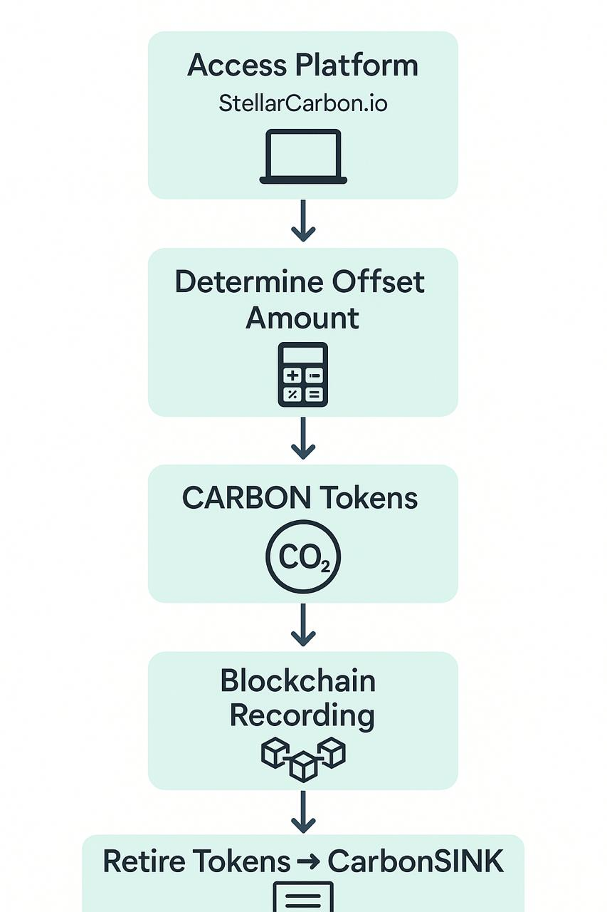

# Testing report

Voor elke vraag (die niet over het formulier zelf ging) heb ik de antwoorden gelezen en interessante dingen uitgelicht. Bij open vragen heb ik AI de antwoord laten samenvatten.

Veel te bespreken.

## 2. Which pages did you visit?

Bijna iedereen (>90%) heeft alle pagina's bezocht. Vooral handig om individuele sessies te analyzeren.

## 3. What did you think about the amount of information provided?

```
5 (Strongly agree): 2 users (6%)
4 (Agree): 13 users (41%)
3 (Neutral): 14 users (44%)
2 (Disagree): 2 users (6%)
1 (Strongly disagree): 0 users (0%)

Average: 3.7
```

Overall, the amount of information feels “about right” to most testers, but the sizable neutral cohort implies there’s room to refine clarity or depth.

## 4. The level of detail was appropriate for me.

```
5 (Strongly agree): 2 users (6%)
4 (Agree): 17 users (53%)
3 (Neutral): 10 users (31%)
2 (Disagree): 3 users (9%)
1 (Strongly disagree): 0 users (0%)

Average: 3.6
```

A third of users are neutral—this hints at potential opportunities to tweak where and how detail is presented (e.g., collapsing secondary info, clarifying jargon, or adding contextual tooltips).

Sluit aan op het idee om sub-navigaties op de relevante pagina's toe te voegen.

## 5. Did you miss any information or other content on the website?

### Mijn analyse

Mijn interpretatie is dat het nog steeds onduidelijk is wat Stellarcarbon doet. Door terminlogie als "carbon sinken" begrijpen gebruikers helemaal niet wat er gebeurt. We moeten op een of andere manier goed duidelijk maken wat het doel is. Sluit aan op het idee van sub-navigaties.

### Uitgelicht

Begrip creeren

- **"There is a lot of background information on what you do, projects, partners etc, but after browsing the site, I'm still not sure what I'm going to do."**
- **"maybe just add a FAQ section, that would include a simplified explanation of carbon credits"**
- **"Information about how to pay and/or why you need to use a blockchain wallet"**

Goed idee

- **"A link to more info on Verra in general could be nice. I found one Verra link but that was for the specific project."**

Toon/persoonsvorm

- **"I think all the text is written from a 'pitch' perspective where the reader is assumed to be a grant giver."**

  Wat ik wel een beetje herken denk ik. Zijn/haar suggesties:

  - **"Instead I'd look directly at the end user who is visiting the page and address them instead (consumer or builder): "You can contribute to nature based projects." "Stellarcarbons provides you with a convenient way to use XLM." "Improve your own product by tapping into our API and making it easy for your users to contribute.""**

Via whatsapp kreeg ik deze inspiratie voor easy accesible explainer image ergens op de landing bijv. (Steven, ook app developer)

<p>
  
</p>

<details>
    <summary style="font-size:1.25em; font-weight:bold;">AI analyse</summary>
#### Visual Explainers & Data

- Count: ~12 mentions

Many users asked for diagrams/flowcharts to show the token lifecycle, how sinking works, or how StellarCarbon offsets emissions.

Calls for graphs or dashboards illustrating impact (e.g. “how much Stellar Carbon is helping offset emissions like a graph under transactions”).

Suggestions to replace “walls of text” with images, infographics, or a more visual approach.

#### Guidance on “What I Can Do” & Use Cases

- Count: ~9 mentions

“A 1–2 sentence introduction that explains what I can do on the website.”

Desire for concrete examples or tutorials (“how to estimate carbon to buy,” “case study and motivation examples,” “example or use case story”).

Business-side guidelines: how builders/consumers integrate or contribute via the API.

#### Audience-Segmented Content / Storytelling

- Count: ~6 mentions

Need to tailor content for different groups: carbon-credit experts, blockchain users, and ordinary offsetters.

Suggestions to adopt a storytelling/emotional approach for retail audiences before diving into technical detail.

#### FAQ / Simplified Explanations & Glossary

- Count: ~5 mentions

Add a FAQ section covering basics (e.g. “What’s a carbon credit?”, “Why use a blockchain wallet?”).

Link labels (“read more”) to be made clickable and clearer.

Simplification of jargon-heavy content for newcomers.

#### “About Us” & Project Details

- Count: ~7 mentions

More on partners/projects, and social-impact co-benefits (e.g. Ucayali project’s local impact).

A concise “About us” summary on the landing page outlining mission/vision and team.

Better visibility of PDF resources (labels like [PDF] or embedded previews).

</details>

## 6. Did you experience any other issues with the website?

### Mijn analyse

Inconsistentie in page design (About us geen header, background hergebruikt tussen software & explorer) en tx explorer niet intuitief.

Stellar niet linken

- **"The first link on the page takes me away from your site to the SDF site, that's not very immersive/engaging."**

Verwende users

- **"The site needs more rich media, like video, audio, pictures, and graphics."**

- Gebruiker 28 vind het er allemaal kut uitzien en suggest UX/UI designer inhuren (ook in zijn andere antwoorden).

Wallet Connect UX & errors

- **"...But then it was showing some Not Found Error, which is bad. The Wallet Connection UX can really be improved. "**

<details>
    <summary style="font-size:1.25em; font-weight:bold;">AI analyse</summary>

1. Functional Bugs & Wallet UX
   Count: ~4 mentions

Issues: Form inputs clearing when switching to the calculator; unclickable “X” button and xBull login failures; “Not Found” errors on wallet connect; pages stuck loading on invalid transactions.

2. Content Labels & Structure
   Count: ~4 mentions

Issues: Rename “Software” to “Docs” and “Explain” to “Learn”; overly long “About Us” page needing splits or a blog-style section; mission phrasing tweaks.

3. Visual Design & Dark-Mode Contrast
   Count: ~3 mentions

Issues: Favicon and early-adopter logos hard to see in dark mode; site feels too dark/uninviting and hard to read.

4. Rich Media & Text Density
   Count: ~2 mentions

Issues: Pages are too text-heavy—requests to replace walls of text with images, videos, infographics, or audio to tell the story.

</details>

## 7. Were there any parts of the website that gave you a positive impression of Stellarcarbon?

### Mijn analyse

Kwam terug dat de Projects pagina fijn wordt gevonden omdat dat de geld-besteding concreet maakt. Meer focus op project leggen lijkt me goed aansluitend op dat mensen niet goed begrijpen waar ze voor betalen. Concreet maken: je geld wordt gebruikt voor een bos behoud project in Peru.

<details>
    <summary style="font-size:1.25em; font-weight:bold;">AI analyse</summary>
1. Transaction Explorer & Dashboard (≈6 mentions)
   Users praised the slick, real-time transaction explorer and intuitive dashboard flow (“very fluid,” “compelling,” “easy to understand”).

2. Design & Navigation (≈4 mentions)
   The clean, simple layout and smooth navigation earned kudos as a great landing page for newcomers.

3. Projects Page (≈4 mentions)
   The “Projects” section—especially Verra integration—was singled out for demonstrating legitimacy and live impact.

4. Trust & Transparency (≈4 mentions)
   Clear explanations, open-source software links, verification registry references, and explorer transparency instilled confidence.

5. Visual/Color Theme (≈3 mentions)
Green scenery backgrounds, rainforest imagery, and calming color themes resonated well with the environmental message.
</details>

## 9. How easy was it to connect your wallet?

```
5 (Very easy): 9 (35%)
4 (Easy): 11 (42%)
3 (Neutral): 2 (8%)
2 (Difficult): 1 (4%)
1 (Very difficult): 3 (12%)

No response: 6

Average: 3.85
```

Sommige gebruikers ervaren (ernstige) problemen anderen niet.

## 10. How many times did you use the sink carbon form?

Skipping

## 11. Rate your experience using the "Sink CARBON" form. When using the form,

Skipping

## 13. If you used the estimator, please rate your experience. When using the estimator,

Skipping

## 14. How well did you understand what your "pending retirement balance" means?

```
Not at all: 6 (26%)
Somewhat: 11 (48%)
Fairly well: 6 (26%)
```

<details>
    <summary style="font-size:1.25em; font-weight:bold;">AI recommendations</summary>

Recommendations
Inline Tooltip or Info Icon: Add a brief hover/tap definition (“Amount of carbon you’ve retired but that’s still processing on the network”).

Onboarding Callout: On first use, surface a one-time modal or banner explaining key terms (pending vs. retired balance).

Reword the Label: Consider a more intuitive phrase like “Awaiting Retirement” or “Pending Carbon Retirement.”

Contextual Help: Link to a very short glossary or FAQ entry right next to the balance so users can click for more detail without leaving the dApp.

</details>

## 15. Did you care about receiving a personal certificate?

```
No, I'd be fine with a community certificate. 12 (52%)
Yes, I'd prefer a personal certificate when possible. 11 (48%)
```

50-50.... mooie boel!

## 16. Did the page provide sufficient information about each transaction?

```
No, I was missing some information. 2 (9%)
Yes, this was the right level of detail for me. 19 (82%)
Actually, there was more information than I cared to see. 2 (9%)
```

## 17. Could you tell us about any pain points you experienced while using the dApp?

### Mijn analyse

Wallet connection errors moeten beter. Onthoud form state tussen errors. Error message strings duidelijker.

Gebruikers verwachten dat de input in sinkform preserved blijft bij browsen naar andere pages. Lijkt me een goede feature om dit te preserveren, geen downsides.

Pending certificate en fractional retirement uitleg linkjes doen het niet. Dit waren idd stubs.

1 VCU = 1 C = 1 CarbonSINK = 1 ton CO2 = 1000 kilo CO2 moet bij de calculator op het sink formulier staan. Nu onduidelijk hoeveel CO2 gelijk aan 1C is TENZIJ je de /explain pagina hebt gelezen.

Geen goeie return functie uit emissions estimator als je niet door wilt. Ook hier wordt genoemd form state preserven.

Vond dit een interessante quote, misschien iets mee doen.

- **"This might only be me, but I kept clicking on the wallet buttons waiting for a popup."**

Ook leuk

- **"not a real pain-point but the suggestions for airports should priotize the short-codes if given a match"**

<details>
    <summary style="font-size:1.25em; font-weight:bold;">AI analyse</summary>

1. Form Resets & Data Loss (≈5 mentions)
   Issues: Inputs (amount, label, form state) clear when navigating back, on errors, or after failed payment paths—forcing users to re-enter data.

2. Wallet Onboarding & Connection UX (≈4 mentions)
   Issues: Excessive clicks to connect, unclear popup behavior, broken wallet logins (xBull, LOBSTR), and loss of the signing pop-up when clicking links.

3. Information & Link Breakages (≈3 mentions)
   Issues: “What does this mean?” tooltips don’t work; trustline-change details lack explanation; typo’d or non-functional “Read more” links.

4. Flow & Navigation (≈2 mentions)
Issues: Hard to find the dApp from non-home pages; no in-UI “back” option in the calculator flow; confusing ordering of signing steps.
</details>

## 18. What could we do to solve these pain points?

### Mijn analyse

Tone of voice van wallet connection element beter.

- **""No wallet connected! To sink CARBON please connect a wallet." I would suggest switching from the negative to a more invitational tone like "Let's connect your account first to...". This helps differentiate from an unexpected situation or friction point to sound more like a soft step towards the goal"**

Keep sink form state between navigation.

Label length maximum enforcen door gewoon niet meer karakters toe te laten "as the user types".

Textarea nodigt uit voor lange messages bij label. Misschien op desktop input-type-text?

Mensen ervaren het dApp gedeelte als de "true homepage". En lastig te bereiken. Zit te denken aan "Go to dApp"-button op landing ipv "Sink CARBON"-button. Dat is algemener.

Suggestie om wallet connect flow intuitiever te maken: direct wallets kit gebruiken en dat doen on-tap van de wallet knop. Daarna pas contact form en T&C invullen. Maakt error handling ook beter geisoleerd.

back button emissions calculator

airport autocomplete moet de airport-code prioriteren over fullname matches

<details>
    <summary style="font-size:1.25em; font-weight:bold;">AI analyse</summary>

1. Form Resets & Data Loss
   Count: ≈5 mentions
   Users reported that inputs (amount, label, form state) clear when navigating back, on validation errors, or after failed payment paths, forcing them to re-enter data.

2. Wallet Onboarding & Connection UX
   Count: ≈4 mentions
   Testers found the wallet-connect flow unclear or cumbersome, citing too many clicks, lost pop-ups, and broken logins (e.g. xBull, LOBSTR).

3. Information & Link Breakages
   Count: ≈3 mentions
   “What does this mean?” tooltips and “Read more” links often didn’t work, and trustline changes lacked explanation.

4. Flow & Navigation
Count: ≈2 mentions
The dApp link isn’t prominent off the homepage, there’s no in-UI back button in the calculator, and signing steps felt disjointed.
</details>

## 19. How did your experience compare to any other dApps you might have used?

### Mijn analyse

Overall lijken de testers heel blij met de app.

Wat ik in deze en eerdere antwoorden ook terugzag komen was "constante motivatie om verder te gaan" en "customer focus". Blijkbaar worden in andere (d)Apps constant stukjes of widgets getoond waarmee de user genudged/beloond wordt om door te gaan. Ik heb wel wat ideeen hoe we dit kunnen oppakken.

- **"It seems full featured but worry individuals wont read the explain first. A how to example might help."**

<details>
    <summary style="font-size:1.25em; font-weight:bold;">AI analyse</summary>

1. Smoothness & Ease of Use
   Count: ≈8 mentions
   Users repeatedly praised the dApp as “smooth,” “snappy,” “straightforward,” and “intuitive,” often noting it outpaced other dApps they’ve tried.

2. Feature Support & Transparency
   Count: ≈3 mentions
   Testers appreciated broad wallet support (“supports a lot of wallets”) and clear transaction previews, calling the feature set “full-featured” and “solid.”

3. First-Time dApp Experience
   Count: 1 mention
   For some, this was their very first dApp—and it left a positive impression, with “simple navigation” and clear signing flows.

4. Desire for Contextual Reminders
Count: 1 mention
Compared to other dApps that “remind me why I’m doing this every step,” one user missed ongoing motivation or impact stats during the flow.
</details>

## 20. Which kind of device did you use today?

```
Phone: 4 (12%)
Tablet: 0
Desktop or laptop: 28 (88%)
```

Veel desktop gebruikers. Vraag me af of dat is omdat we ze vragen om te testen en dat ze misschien dat het niet werkt op mobiel ofzo. "In het wild" verwacht ik andere percentages.

## 21.Do you have any previous experience using an app to which you connected a crypto wallet?

```
None whatsoever.: 5 (16%)
Yes, using another blockchain, but not on Stellar.: 4 (12%)
Yes, I've previously used a dApp on Stellar.: 23 (72%)
```

Overall meer Stellar users in dit cohort. Is ook de target audience dus dat lijkt me gezond.

## 22. Have you ever contributed to a climate and/or biodiversity project?

Helaas is deze vraag met checkboxes gesteld. Daardoor onmogelijk antwoorden. Heb alleen de single antwoorden meegeteld.

```
Never, and I don't plan to.: 0
Not yet, but I might.: 17 (65%)
Yes, I've made a donation.: 7 (27%)
Yes, I've purchased an offset.: 2 (8%)
```

In dit cohort dus veel mensen die het wel aanspreekt, maar velen hebben het nog nooit gedaan.

## 23. Is there anything else you'd like us to know?

### Mijn analyse

Dit gaat alle kanten op. Antwoorden individueel lezen.

<details>
    <summary style="font-size:1.25em; font-weight:bold;">AI analyse</summary>

1. Positive Encouragement & Willingness to Continue
   Count: ≈9 mentions
   Testers repeatedly thanked the team, praised the dApp’s intuitiveness, and offered to help test future features.

2. Audience Segmentation & Tailoring
   Count: ≈2 mentions
   Some noted that different user types (business vs. retail) may need content hidden or explained differently.

3. UI Simplification & Design Polish
   Count: ≈2 mentions
   A few suggested hiring a web designer to simplify the look and improve first impressions when going live.

4. Messaging Clarity
   Count: ≈2 mentions
   One user pointed out contradictory phrasing in the pending retirement message and recommended clearer, more concise copy.

5. Incentives & Integrations
   Count: ≈2 mentions
   Ideas surfaced about offering loyalty rewards (e.g., XP) or embedding offset options into other payment flows (e.g., remittance providers, flight checkouts).

</details>
